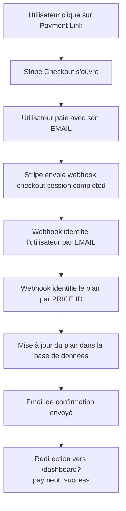

# 🔗 Configuration des Payment Links Stripe

## 📋 Vue d'ensemble

Les **Payment Links** sont des liens directs vers des pages de paiement Stripe. Ils sont plus simples que l'API Checkout car :
- ✅ Pas besoin de code backend pour créer les sessions
- ✅ Gestion des codes promo dans Stripe Dashboard
- ✅ Liens réutilisables et partageables
- ✅ Activation automatique du plan après paiement

---

## 🎯 Configuration requise dans Stripe Dashboard

### 1️⃣ **Créer un Payment Link**

1. Allez sur [Stripe Dashboard](https://dashboard.stripe.com) → **Payment Links**
2. Cliquez sur **"+ New"** (ou "Créer")

### 2️⃣ **Configuration du Payment Link**

#### **Produit et Prix**
- **Produit** : Sélectionnez votre produit (PRO ou ELITE)
- **Prix** : Sélectionnez le prix correspondant (mensuel ou annuel)
  - ELITE Mensuel : `price_1SLk9TH23JS5N2cDv057Uzv8`
  - ELITE Annuel : `price_1SLk92H23JS5N2cDvKHW9X0n`
  - PRO Mensuel : `price_1SLk8KH23JS5N2cDps6VfY3W`
  - PRO Annuel : `price_1SLkA2H23JS5N2cDiEmU195J`

#### **Options importantes** ⚠️

##### ✅ **Collect customer email**
**OBLIGATOIRE** : Activez cette option pour que le webhook puisse identifier l'utilisateur.
```
☑️ Collect customer email
```

##### ✅ **Allow promotion codes**
Activez si vous voulez permettre l'utilisation de codes promo :
```
☑️ Allow promotion codes
```

##### ✅ **After payment** (URLs de redirection)
- **Success URL** : `https://athlink.fr/dashboard?payment=success`
- **Cancel URL** : `https://athlink.fr/dashboard/upgrade?payment=cancelled`

#### **Récurrence** (pour les abonnements)
- Mode : **Subscription** (abonnement récurrent)
- Facturé : **Monthly** ou **Yearly** selon le prix

---

## 🎣 Comment le webhook fonctionne

### **Flux de paiement**



### **Code du webhook** (déjà implémenté)

Le webhook `/api/stripe/webhook` fait automatiquement :

1. ✅ **Identification de l'utilisateur**
   ```typescript
   // Si pas de metadata (Payment Link), on cherche par email
   const user = await prisma.user.findUnique({
     where: { email: session.customer_email }
   })
   ```

2. ✅ **Identification du plan par Price ID**
   ```typescript
   const priceIdMapping = {
     'price_1SLk9TH23JS5N2cDv057Uzv8': 'ELITE',  // ELITE Mensuel
     'price_1SLk92H23JS5N2cDvKHW9X0n': 'ELITE',  // ELITE Annuel
     'price_1SLk8KH23JS5N2cDps6VfY3W': 'PRO',    // PRO Mensuel
     'price_1SLkA2H23JS5N2cDiEmU195J': 'PRO',    // PRO Annuel
   }
   ```

3. ✅ **Mise à jour du profil**
   ```typescript
   await prisma.profile.update({
     where: { userId },
     data: { plan: 'ELITE' } // ou 'PRO'
   })
   ```

4. ✅ **Email de confirmation**
   - Notification automatique avec détails du plan
   - Lien vers le dashboard

---

## 📝 Liste des Payment Links à créer

| Plan | Cycle | Price ID | Status | Lien |
|------|-------|----------|--------|------|
| **ELITE** | Mensuel | `price_1SLk9TH23JS5N2cDv057Uzv8` | ✅ Configuré | `https://buy.stripe.com/00w6oH9iSgu3fbL7WdeQM00` |
| **ELITE** | Annuel | `price_1SLk92H23JS5N2cDvKHW9X0n` | ⏳ À créer | - |
| **PRO** | Mensuel | `price_1SLk8KH23JS5N2cDps6VfY3W` | ⏳ À créer | - |
| **PRO** | Annuel | `price_1SLkA2H23JS5N2cDiEmU195J` | ⏳ À créer | - |

---

## 🔧 Ajouter les liens dans le code

Une fois les Payment Links créés, ajoutez-les dans `/app/(dashboard)/dashboard/upgrade/page.tsx` :

```typescript
const STRIPE_PAYMENT_LINKS = {
  ELITE_MONTHLY: "https://buy.stripe.com/00w6oH9iSgu3fbL7WdeQM00", // ✅
  ELITE_YEARLY: "https://buy.stripe.com/VOTRE_LIEN_ICI",  // ⏳ À ajouter
  PRO_MONTHLY: "https://buy.stripe.com/VOTRE_LIEN_ICI",   // ⏳ À ajouter
  PRO_YEARLY: "https://buy.stripe.com/VOTRE_LIEN_ICI",    // ⏳ À ajouter
}
```

---

## ⚠️ Points d'attention

### **1. Email obligatoire**
Sans l'email du client, le webhook ne peut pas identifier l'utilisateur !
```
☑️ OBLIGATOIRE : Collect customer email
```

### **2. L'utilisateur doit utiliser le MÊME email**
L'utilisateur DOIT payer avec le même email que celui de son compte Athlink.
Sinon, le webhook ne trouvera pas son profil.

### **3. Variables d'environnement sur Vercel**
Les 4 Price IDs doivent être configurés sur Vercel :
```env
STRIPE_PRICE_ID_ELITE_MONTHLY=price_1SLk9TH23JS5N2cDv057Uzv8
STRIPE_PRICE_ID_ELITE_YEARLY=price_1SLk92H23JS5N2cDvKHW9X0n
STRIPE_PRICE_ID_PRO_MONTHLY=price_1SLk8KH23JS5N2cDps6VfY3W
STRIPE_PRICE_ID_PRO_YEARLY=price_1SLkA2H23JS5N2cDiEmU195J
```

---

## 🧪 Tester le Payment Link

### **Test en production**

1. Allez sur `https://athlink.fr/dashboard/upgrade`
2. Sélectionnez **Mensuel**
3. Cliquez sur **"Passer Elite"**
4. Vous serez redirigé vers le Payment Link Stripe
5. Entrez votre email (le MÊME que votre compte Athlink)
6. Utilisez une carte de test Stripe : `4242 4242 4242 4242`
7. Validez le paiement
8. Le webhook activera automatiquement votre plan ELITE
9. Vous recevrez un email de confirmation
10. Vous serez redirigé vers `/dashboard?payment=success`

### **Vérifier le webhook**

Allez sur **Stripe Dashboard** → **Webhooks** → Votre webhook → **Events**
Vous devriez voir l'événement `checkout.session.completed` avec le statut **200 OK**.

---

## 📧 Email de confirmation automatique

Après paiement réussi, l'utilisateur reçoit automatiquement un email avec :
- ✅ Confirmation du paiement
- ✅ Détails du plan activé
- ✅ Liste des fonctionnalités débloquées
- ✅ Lien vers le dashboard

---

## 🚀 Prochaines étapes

1. **Créer les 3 Payment Links manquants** dans Stripe Dashboard
2. **Copier les liens** et les donner pour les ajouter dans le code
3. **Tester chaque lien** en production avec une carte de test
4. **Vérifier les logs** du webhook pour chaque test

---

✅ **Configuration actuelle** : ELITE Mensuel opérationnel
⏳ **À configurer** : ELITE Annuel, PRO Mensuel, PRO Annuel

